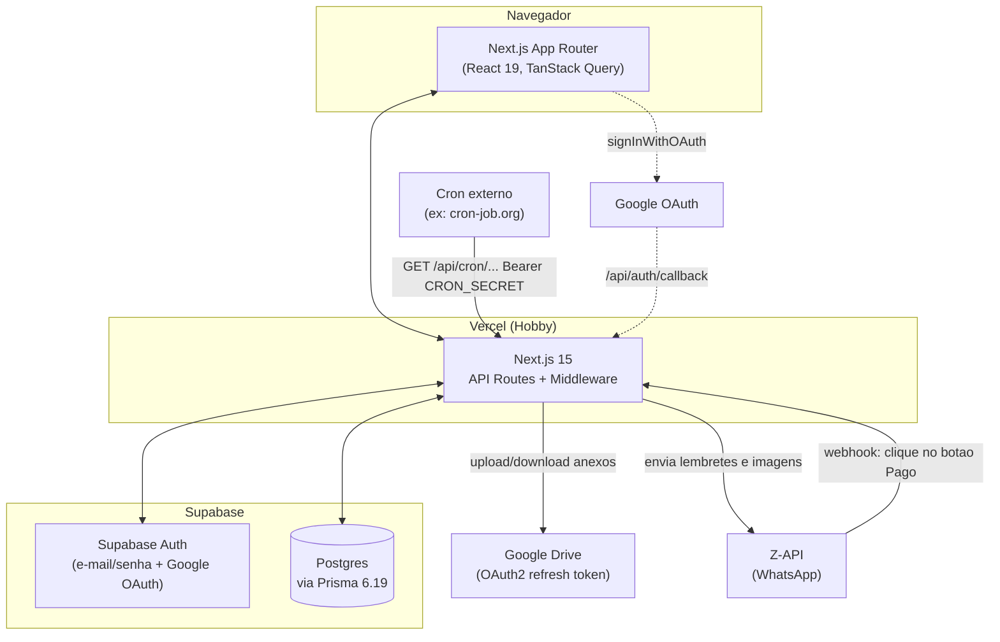
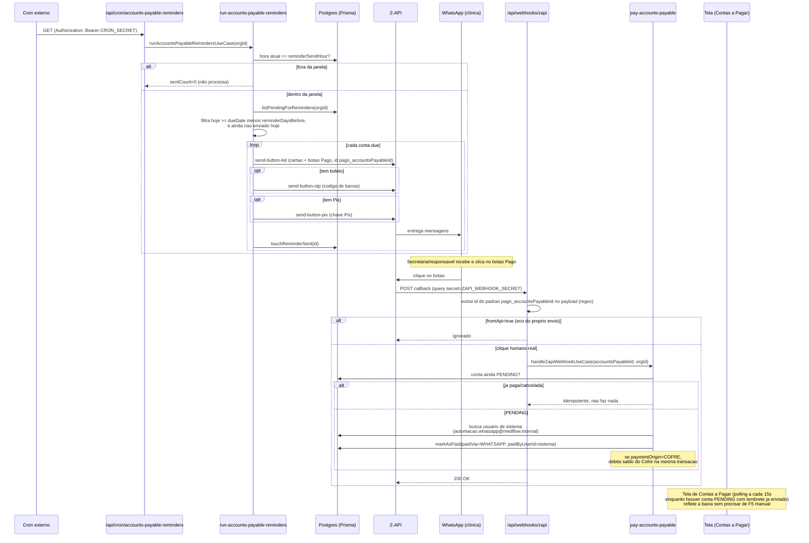

# Arquitetura do MedFlow — estado real (verificado em código)

> Este documento descreve o sistema **como ele está implementado hoje**,
> não como foi planejado em algum momento das conversas de
> desenvolvimento. Cada afirmação abaixo foi conferida contra o código,
> `package.json`, `prisma/schema.prisma`, `.env.example` e as migrations
> reais antes de ser escrita — decisões que mudaram de rumo durante o
> desenvolvimento (ex: confirmação de pagamento por botão → texto →
> botão de novo; Google Drive via Service Account → OAuth2) estão
> documentadas no estado final, com uma nota do porquê quando relevante.
>
> Para o documento de planejamento original (pré-implementação), ver
> `docs/architecture/MedFlow-Arquitetura-e-Sprint1.md` — este arquivo
> aqui é o que substitui aquele como referência de "como é hoje".

## 1. Visão geral da stack

| Camada | Tecnologia | Versão | Observação |
|---|---|---|---|
| Frontend + Backend | Next.js (App Router) | 15.5.20 | Sem backend separado — API Routes fazem esse papel (CLAUDE.md) |
| UI | React | 19.1.0 | |
| Estilo | Tailwind CSS | v4 (`@tailwindcss/postcss`) | |
| Componentes | shadcn/ui + Radix UI | `radix-ui` 1.6.1 | |
| Formulários | React Hook Form + Zod | 7.80.0 / v4 | Schema compartilhado front/back |
| Estado de servidor | TanStack Query | 5.101.2 | |
| Ícones | lucide-react | 1.23.0 | |
| ORM | Prisma | 6.19.3 | Client gerado em `prisma generate` (parte do `npm run build`) |
| Banco de dados | PostgreSQL via Supabase | — | Ver detalhe de pooling abaixo |
| Autenticação | Supabase Auth | `@supabase/ssr` ^0.12.0, `@supabase/supabase-js` ^2.110.0 | Ver seção 1.2 |
| Google Drive | `googleapis` | 173.0.0 | Ver seção 2 |
| Hospedagem | Vercel | — | Ver seção 1.3 |
| Testes | Vitest | 4.1.9 | `npm run test` |

Não há biblioteca de gráficos instalada (`recharts` foi removida do
`package.json` em algum momento do desenvolvimento). O Dashboard hoje
não tem gráfico de barra/linha/pizza — só cards de KPI e um "fluxo"
vertical de nós com ícone (Recebimentos → Caixa → Cofre → Pagamentos →
Saldo Disponível), sem nenhuma lib de visualização por trás. Os únicos
gráficos de verdade do sistema (barras, rosca) estão nos Status Reports
em imagem, desenhados à mão dentro do `next/og` — ver seção 4.

### 1.1 Banco de dados e ORM

- Postgres hospedado no Supabase.
- Duas connection strings distintas (`prisma/schema.prisma`):
  - `DATABASE_URL` — pooler de transação (porta 6543, `pgbouncer=true`), usado pela aplicação em runtime.
  - `DIRECT_URL` — pooler de sessão (porta 5432), usado só pelo Prisma CLI (`migrate`/`db seed`).
- Prisma Client é um singleton (`src/core/database/prisma.client.ts`), guardado em `globalThis` para sobreviver a hot-reloads em desenvolvimento sem recriar a conexão a cada mudança de arquivo.
- Regra de arquitetura: `@prisma/client` só pode ser importado a partir desse arquivo — repositórios de features nunca importam o client diretamente.
- 23 migrations aplicadas até o momento (`prisma/migrations/`).
- IDs são todos `cuid()`/`uuid()` — não existe nenhuma coluna `SERIAL`/`IDENTITY` no schema.

### 1.2 Autenticação

- Supabase Auth, dois métodos:
  1. **E-mail/senha** — formulário próprio (`login-form.tsx`) → `POST /api/auth/login`.
  2. **Google OAuth** — botão "Entrar com Google" (`supabase.auth.signInWithOAuth`) → callback em `/api/auth/callback`.
- Sessão via cookies (`@supabase/ssr`), validada no `middleware.ts` com `supabase.auth.getUser()` (não `getSession()` — valida o token contra o servidor do Supabase a cada request, em vez de só ler o cookie).
- Rotas protegidas: prefixo `/dashboard`. Prefixo `/login` redireciona se já autenticado.
- Um trigger em `auth.users` (`handle_new_auth_user`, migration dedicada) provisiona automaticamente uma linha em `public.users` com `status: PENDING` no primeiro login (convite de Admin ou primeiro login via Google) — sem `roleId` até alguém atribuir um perfil na tela de Gestão de Acessos.
- RBAC próprio (`Role`/`Permission`, tabelas `roles`/`permissions`/`_PermissionToRole`), 5 perfis: `ADMIN`, `OWNER`, `SECRETARY`, `FINANCE`, `ACCOUNTANT`. Autorização decidida sempre no backend (`requirePermission`); frontend só reflete visualmente.

### 1.3 Hospedagem

- Vercel, plano **Hobby** (confirmado pelos comentários no código sobre as limitações desse plano — cron nativo só 1x/dia com schedule fixo, `maxDuration` de rota limitado a 60s).
- `vercel.json` no repositório está vazio (`{}`) — **não há nenhum cron nativo da Vercel configurado**. O agendamento de lembretes de WhatsApp é feito por um serviço externo (ver seção 3).
- `next.config.ts` só tem o wrapper do `@next/bundle-analyzer` (ativado via `ANALYZE=true npm run build`) — sem configuração adicional de imagens, redirects ou headers customizados.

## 2. Armazenamento de arquivos (GED) — Google Drive

**Implementado e funcional**, mas **não** da forma inicialmente planejada.

- ~~Service Account~~ foi **descartada durante o desenvolvimento**: contas de serviço do Google não têm cota de armazenamento própria no Drive ("Service Accounts do not have storage quota") — todo upload falhava mesmo com a pasta compartilhada como Editor.
- Implementação real: **OAuth2 com refresh token** (`src/core/google-drive/google-drive.client.ts`), usando a biblioteca `googleapis`.
  - O refresh token é gerado **uma única vez, fora do código**, via consentimento OAuth do usuário dono do Drive, já com o escopo `drive.file`.
  - A cada requisição, o client só reaproveita esse refresh token (`setCredentials`) — a biblioteca troca por um access token novo automaticamente quando necessário.
  - Variáveis: `GOOGLE_OAUTH_CLIENT_ID`, `GOOGLE_OAUTH_CLIENT_SECRET`, `GOOGLE_OAUTH_REFRESH_TOKEN`, `GOOGLE_DRIVE_FOLDER_ID`.
  - Opcionais no schema de ambiente (`core/utils/env.ts`) — se ausentes, a aplicação inteira continua de pé; só o recurso de anexos falha, com erro claro no momento do uso.
- Usado para anexos de Contas a Pagar (boleto, comprovante, nota fiscal) — tabela `accounts_payable_attachments` guarda só o metadado (`driveFileId`, nome, mimeType, tamanho); o arquivo em si vive no Drive.
- Upload, download (stream) e exclusão implementados e testados (`uploadFileToDrive`, `downloadFileFromDrive`, `deleteFileFromDrive`). Exclusão é best-effort: um 404 do Drive (arquivo já removido manualmente por fora) não impede remover o registro do banco.
- Erro de `invalid_grant` (refresh token revogado/expirado) é traduzido numa mensagem específica orientando gerar um novo refresh token.

## 3. Integração WhatsApp (Z-API)

Fluxo completo, validado em produção. Ponto importante verificado no
código: **o mecanismo de confirmação de pagamento oscilou entre botão
nativo e resposta de texto durante o desenvolvimento, e o estado atual
é botão nativo** (o texto solto do prompt original refletia uma etapa
intermediária já revertida — confirmado lendo o histórico documentado
em `zapi-client.ts`).

### 3.1 Cadastro e configuração

- Cada Conta a Pagar tem `reminderDaysBefore` (dias de antecedência, padrão 5) e `lastReminderSentAt`/`lastReminderMessageId` (controle de idempotência).
- Cada organização tem `OrganizationSettings.reminderSendHour` (hora 0-23, padrão 7, configurável na tela de Configurações) e `OrganizationSettings.whatsapp` (número da clínica — **um único número por organização**, não por conta).

### 3.2 Disparo — cron externo, não nativo da Vercel

- `vercel.json` vazio confirma: **não há cron nativo da Vercel configurado**. O plano Hobby só permite cron 1x/dia com schedule fixo (exige redeploy pra mudar o horário) — inviável para um horário configurável pela tela de Configurações.
- Em vez disso, um serviço de cron **externo** (ex: cron-job.org, conforme comentado no código) chama `GET /api/cron/accounts-payable-reminders` com a frequência que o operador configurar (ex: de hora em hora).
- Autenticação: header `Authorization: Bearer $CRON_SECRET`.
- A rota em si não decide o horário — ela sempre roda quando chamada, mas o **núcleo do cron** (`run-accounts-payable-reminders.use-case.ts`) só processa de verdade quando a hora atual, no timezone da organização, bate exatamente com `OrganizationSettings.reminderSendHour`. Isso é o que garante disparo único por dia mesmo com o serviço externo chamando várias vezes por hora.
- Dentro da janela certa, filtra as contas pendentes em código: `hoje >= dueDate − reminderDaysBefore` **e** ainda não recebeu lembrete hoje (`lastReminderSentAt`) — essa segunda checagem permite chamar a rota várias vezes na mesma hora sem duplicar envio.
- `maxDuration = 60` (teto do plano Hobby) — cada conta due dispara até 3 mensagens em sequência com ~3s de intervalo entre elas; **não há mensagem separadora entre contas diferentes do mesmo lote** (existiu em algum momento, foi removida — visualmente não funcionava bem).

### 3.3 Mensagens enviadas por conta (Z-API, botões nativos)

1. **Cartão-resumo** com botão **"Pago"** (`/send-button-list`) — texto com fornecedor, descrição, valor, vencimento. O id do botão carrega o id da conta: `pago_<accountsPayableId>`.
2. **Código de barras** (condicional — só se a conta tiver `barcode` cadastrado), com botão nativo de copiar (`/send-button-otp`). Primeira linha em negrito é o nome do fornecedor.
3. **Chave Pix** (condicional — só se `pixKey` cadastrado), com botão nativo de copiar (`/send-button-pix`). Tipo sempre `"EVP"` (chave aleatória) — o cadastro do MedFlow não distingue o tipo de chave hoje.

Nota confirmada anteriormente com a Z-API (documentação oficial):
o rótulo "Chave aleatória" exibido pelo WhatsApp para chaves `EVP` é
renderizado nativamente pelo card de Pix a partir do `type` enviado —
não há campo na API para customizar esse texto.

### 3.4 Webhook — confirmação de pagamento

- `POST /api/webhooks/zapi` — sem sessão (não há usuário logado num callback de webhook).
- Autenticação por **secret na query string** (`?secret=`), não header — o painel da Z-API só permite anexar a URL do webhook, sem campo de header customizado.
- Extração do id da conta: procura o padrão `pago_<id>` em qualquer lugar do payload bruto (regex), em vez de um campo fixo — o formato exato de onde a Z-API embute o id do botão clicado no callback nunca foi confirmado contra a API real, então a extração é tolerante ao formato.
- **Filtro de eco**: a própria mensagem que o sistema envia (o cartão-resumo com o botão embutido) dispara esse mesmo webhook de volta, ecoando o `pago_<id>` original. O campo `fromApi: true` no payload identifica esses ecos (confirmado empiricamente) — sem filtrar isso, qualquer evento relacionado à mensagem do sistema confirmaria o pagamento sozinho.
- Resolve a organização via `prisma.organization.findFirst()` (MVP mono-organização — mesmo padrão do cron).
- Confirmação é **idempotente**: se a conta já não está `PENDING`, o 2º clique (ou eco duplicado) não faz nada.
- O pagamento é confirmado com `paidByUserId` de um **usuário de sistema** (`automacao.whatsapp@medflow.internal`, buscado por e-mail em tempo real) — nunca a pessoa que clicou, já que o WhatsApp não autentica quem está do outro lado do número da clínica.
- Nenhuma mensagem de confirmação é enviada de volta ao WhatsApp (decisão de produto) — a baixa acontece silenciosamente no sistema.

### 3.5 Atualização da tela em tempo real

**Não é Supabase Realtime.** É **polling condicional** via TanStack Query:
a listagem de Contas a Pagar (`use-accounts-payable.ts`) usa
`refetchInterval` de **15 segundos**, mas só enquanto existir alguma
conta `PENDING` com `lastReminderSentAt` preenchido (ou seja, aguardando
confirmação via clique) — sem isso, o status só atualizava depois de um
F5 manual. Escolhido deliberadamente por ser mais simples de manter do
que configurar canal/policies de Supabase Realtime só para esse caso.

## 4. Relatórios em imagem (Status Reports)

Implementado — dois relatórios até o momento, mesma técnica para os dois:

- **Tecnologia**: `next/og` (`ImageResponse`, baseado no Satori). Satori só renderiza um subconjunto de flexbox/CSS e SVG explícito — não roda bibliotecas de gráfico como Chart.js/Recharts. Por isso todos os gráficos (barras, rosca) são desenhados à mão: barras com `
` de largura proporcional, rosca com `<circle>` + `strokeDasharray`/`strokeDashoffset`, rótulos de percentual posicionados por trigonometria no ponto médio de cada fatia.
- **Formato**: imagem PNG 1080×1920px (vertical, formato "story"), gerada on-the-fly a cada requisição (`Cache-Control: no-store`) — nunca fica hospedada em nenhum lugar entre as chamadas.
- **Relatórios existentes**:
  1. **Status Report** (genérico) — resumo financeiro do período (saldo do Cofre, entradas/saídas, resumo por categoria).
  2. **Status Report: Contas Pagas** — total pago, origem do pagamento (Banco/Cofre), gastos por categoria (barras horizontais), Top 5 Beneficiários, pagamentos por semana.
- **Entrega**: dupla, para os dois relatórios —
  - **Download**: a mesma URL da imagem (`/api/reports/.../image?dateFrom=...&dateTo=...`) serve tanto o preview (``) quanto o download (`<a download>`).
  - **WhatsApp**: botão "Enviar por WhatsApp" na tela → rota dedicada (`/api/reports/.../send-whatsapp`) → gera a imagem, converte para base64, envia via `sendImageMessage` (Z-API `/send-image`) para o número da organização (`OrganizationSettings.whatsapp`).
- Logo da Clínica MAE embutido como asset estático da feature (arquivo `.jpeg` lido do disco e convertido para data URI, cacheado em memória) — solução válida para o MVP mono-organização; viraria upload por organização se o sistema virasse multiempresa de verdade.

## 5. Pontos de contato externos

| Serviço | Para que serve | Quem inicia | Variáveis de ambiente envolvidas |
|---|---|---|---|
| Supabase (Postgres) | Banco de dados principal | Nosso sistema chama (Prisma) | `DATABASE_URL`, `DIRECT_URL` |
| Supabase Auth | Login (e-mail/senha + Google OAuth), sessão | Nosso sistema chama; navegador redireciona pro Google e volta | `NEXT_PUBLIC_SUPABASE_URL`, `NEXT_PUBLIC_SUPABASE_ANON_KEY`, `SUPABASE_SERVICE_ROLE_KEY` |
| Google Drive (OAuth2) | Armazenamento de anexos de Contas a Pagar | Nosso sistema chama | `GOOGLE_OAUTH_CLIENT_ID`, `GOOGLE_OAUTH_CLIENT_SECRET`, `GOOGLE_OAUTH_REFRESH_TOKEN`, `GOOGLE_DRIVE_FOLDER_ID` |
| Z-API (WhatsApp) — envio | Lembrete de cobrança (botões), imagem de relatório | Nosso sistema chama | `ZAPI_INSTANCE_ID`, `ZAPI_TOKEN`, `ZAPI_CLIENT_TOKEN` |
| Z-API (WhatsApp) — webhook | Confirmação de pagamento (clique no botão "Pago") | **Z-API chama a gente** | `ZAPI_WEBHOOK_SECRET` (via query string `?secret=`) |
| Serviço de cron externo (ex: cron-job.org) | Dispara a checagem periódica de lembretes pendentes | **Serviço externo chama a gente** | `CRON_SECRET` (header `Authorization: Bearer`) |
| Vercel | Hospedagem (build + runtime + rotas) | — (infraestrutura) | — |

## 6. Diagramas

### 6.1 Arquitetura geral

### 6.2 Sequência — lembrete de cobrança até confirmação de pagamento

